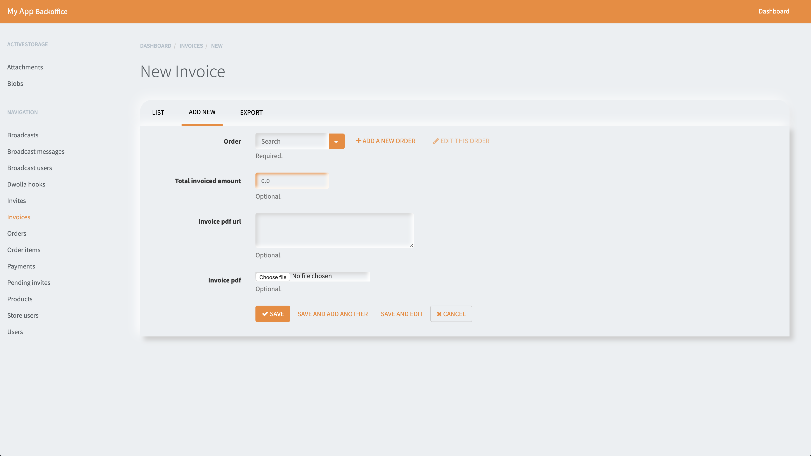

RailsAdmin Neumorphic theme based on [software brothers theme](https://github.com/SoftwareBrothers/rails_admin_softwarebrothers_theme)
===================================================

It is a clean theme which can be used with [Rails Admin](https://github.com/sferik/rails_admin).



To use this theme
---------------------------------------------------

In your Gemfile:

```
gem 'rails_admin_softwarebrothers_theme', :git => 'https://github.com/5hanth/rails_admin_softwarebrothers_theme.git'
```

Inside config/application.rb, just after Bundler.require:

```
ENV['RAILS_ADMIN_THEME'] = 'softwarebrothers_theme'
```
